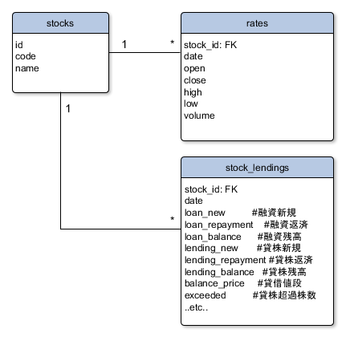

# StockDB

Japanese Stock Rating Importer.

## Tables



## Pre-Requirements

```sh
$ git --version
git version 1.8.3.1
$ docker -v
Docker version 1.10.2, build c3959b1
$ docker-compose -v
docker-compose version 1.6.2, build 4d72027
```

## Usage

```sh
$ git clone https://github.com/unageanu/stock-db.git
$ cd stock-db
$ vi .env # Set POSTGRES_PASSWORD, QUANDL_API_KEY ..etc..
          # See the example below:
---
POSTGRES_USER=postgres
POSTGRES_PASSWORD=mysecretpassword
QUANDL_API_KEY=myquandlapikey
QUANDL_API_VERSION=2015-04-09
---
$ docker-compose up -d # Run PostgreSQL
$ bundle install

$ bundle exec ruby -I src ./src/quandl_importer.rb
# or
$ bundle exec ruby -I src ./src/k_db_importer.rb 2016-01-01 2016-03-01
```


## License

[MIT license](//datatables.net/license)
